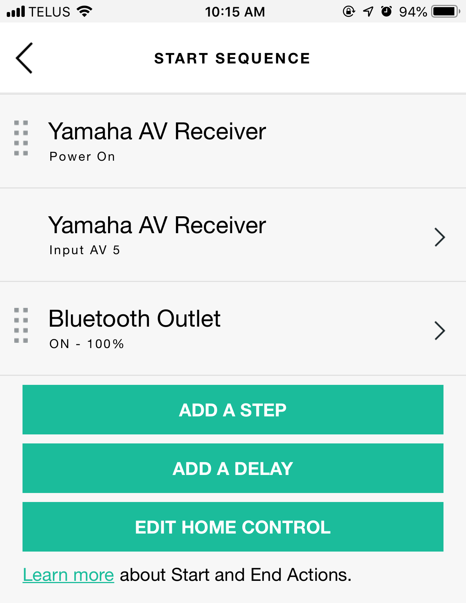
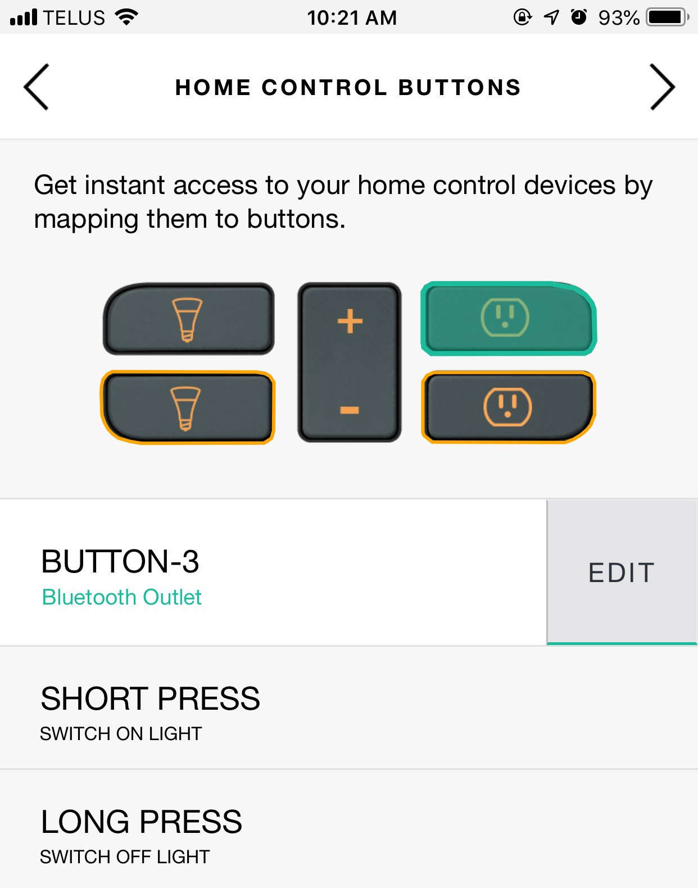

For Christmas this year I received an Amazon Echo Dot. I have never been really interested in voice assistants, but having received one for free I thought I might as well check it out. I have some elements of a smart home. There are a few Philips Hue bulbs scattered throughout my apartment, some smart switches, and a Harmony Home Hub to control my entertainment system. The thought of being able to control these systems with my voice was intriguing. However, once I realized Echo supports multi-room audio I was hooked.

#### The Problem

Multi-room audio with Echo Dots is great. They are relatively inexpensive, they're small, and they offer decent sound quality. While it's not the kind of sound quality I would want in my main listening area, it's adequate for a kitchen or bathroom. While they're good on their own, most of us have some sort of speaker set up in their homes. This can range from portable bluetooth speakers to full home theater systems. I have the latter. I wanted to be able to make use of this system while using multi-room audio.

Amazon supports two ways to connect an Echo to a speaker system:

1. Via bluetooth
1. Via an aux cable

The obvious choice to connect to a home theater receiver would be via aux. It offers the best quality with no latency or fiddling with wireless connections. The major downside of this is that ALL of the Echo's audio will be routed through the line out port. You cannot configure music to route to the aux while voice responses come through the internal speaker. You also can't disable and enable the output using your voice. As long as something is plugged in, the internal speaker is fully disabled. This is a **huge** problem for a home theater system. If I plug the Echo into it using an aux cable:

- I have to leave the receiver on at all times
- I cannot use Alexa while watching TV or listening to music on another source
- I have to always turn the receiver back to the Echo input when I'm done watching TV

This set up would make the whole system much more complicated, meaning it has no value for me.

A bluetooth connection on the Echo is a little bit better. While you cannot choose which audio to route through which output, you *can* use your voice to connect and disconnect to the speaker. That way, you are in control of where the sound is output to. However, it still requires a manual step. Further, my receiver does not have built-in bluetooth.

#### The Solution

The solution I have settled on is somewhat convoluted, but works very well. It involves the following parts:

1. Some sort of stereo system (a home theater receiver in my case)
1. A smart outlet (I'm using a TP-Link model)
1. A Harmony Hub and Remote
1. [Home Assistant](https://www.home-assistant.io/)
1. A bluetooth receiver that runs on wall power (no batteries)
1. An Amazon Echo

The main idea is that the bluetooth receiver is powered via the smart outlet. In turn, the outlet is controlled by the Harmony Hub. By setting up the Harmony to only turn on the bluetooth outlet when the receiver is on the proper source, this allows us to easily control what device the Echo plays sound through.

If the receiver is off or I'm playing something through a different source, I am able to use the Echo as normal. I can also play multi-room audio if I don't care about having it run through the stereo system. When I want the Echo to output to the stereo, I simply press a single button on the Harmony remote (or use a voice command) which does the following:

1. Turns the receiver on
1. Turns the smart outlet, which turns the bluetooth receiver on
    - The Echo automatically connects to this and switches its audio output
1. Sets the receiver to the proper input

When I'm done listening to music on the stereo, I press the "off" button on the remote, everything shuts off, and the Echo switches back to the internal speaker.

#### Setup

Every component is easy to set up on it's own. The problems arise when you try to get everything to talk to each other. This really made me realise what a mess the home automation industry is at the moment. Let's break down the pieces of communication that need to happen for this project:

|Communication|Support|
|---|---|
|Bluetooth Receiver &harr; Amazon Echo|&#10003;|
|Amazon Echo &harr; Harmony Hub|&#10003;|
|Harmony Hub &harr; TP-Link Smart Outlet|&#10007;|

As you can see, the Harmony Hub cannot natively control Wifi devices. It requires a hub (like SmartThings).

##### Home Assistant

To allow Harmony to control the Wifi switch, I used Home Assistant to emulate a hue bridge. This presents a fake Hue bridge on the network that supports non-Hue devices. The Harmony can control this because it just looks like a Hue device.

To get started you'll need to run Home Assistant on a computer in your home. There are a ton of guides out there for different systems so I'm not going to go into depth. I have mine running on a Raspberry Pi using the [`homeassistant/raspberrypi3-homeassistant`](https://hub.docker.com/r/homeassistant/raspberrypi3-homeassistant/) Docker image.

It's a really good idea to give both the computer that is running Home Assistant, and the devices you are connecting to, a static IP address. Then, you can edit the configuration of Home Assistant to include your outlet:

```yaml
switch:
  - platform: tplink
    host: 172.16.1.102
    name: bluetooth_outlet
```

After reloading your configuration, you should be able to control the outlet via the Home Assistant UI.

Next, we need to create a Hue Bridge to expose to Harmony. Again, edit the configuration with the following:

```yaml
emulated_hue:
    expose_by_default: true
    entities:
        switch.bluetooth_outlet:
            name: "Bluetooth Outlet"
```

That should be it!

##### Harmony Hub Setup

To set up your Harmony Hub to work with the emulated Hue bridge, do the following:

1. Open your Harmony app
1. Tap the menu icon, then "Harmony Setup"
1. Choose "Add/Edit Devices & Activities"
1. Choose "Devices"
1. If you currently have a Hue bridge connected to your Harmony, you must delete it
    - If you have lights you still want to control using your Harmony remote, take a look at the [Using Hue Lights with Harmony](#using-hue-lights-with-harmony) section before proceeding
1. Unplug any physical Hue bridges you may have
1. Click "Add Device", then choose "Philips Hue" under "Home Control"
1. When you get to the step that tells you to press the center button, wait for a couple minutes. Home Assitant should automatically send the command to register it
1. Complete the setup
1. Plug your physical Hue bridges back in

You should now be able to set up activities and home control buttons to use your smart outlet!

|Activity|Home Control Button|
|---|---|
|||

<a name="using-hue-lights-with-harmony"></a>

##### Using Hue Lights with Harmony

The one remaining issue with this solution is the ability to control your Hue lights with the Harmony, since we removed the physical bridge from the Harmony's configuration. Harmony can, unfortunately, only connect to one Hue bridge at the time, so we will have to find a way to expose the lights through the emulated bridge.

My home has Hue lights in the Living Room and Bedroom. I only care about controling the Living Room lights with the Harmony because that's the room the remote is in. Hue Bridges can be added to Home Assistant automatically using the UI:

1. Navigate to the UI in a web browser (usually port 8123 of the device it's running on)
1. Click "Configuration" > "Integrations"
1. Under "Set up a new integration", choose "Configure" next to "Philips Hue"
1. Follow the instructions

To expose your lights on the emulated bridge, add them to the `emulated_hue.entities` section of your yaml file:

```yaml
emulated_hue:
    expose_by_default: true
    entities:
        light.living_room:
            name: "Living Room Light"
        switch.bluetooth_outlet:
            name: "Bluetooth Outlet"
```

These entities should now be available for use in your Harmony app!

---

I hope this was a helpful guide to integrating your Amazon Echo with your stereo or home theater sound system. Here are links to some of the products I have used. Note these are NOT affiliate links. However, they are setup to redirect to your local Amazon page using [A-FWD](https://affiliate-geo-target.com).

|Product|Link|
|---|---|
|Amazon Echo|[Amazon Echo Dot](http://a-fwd.com/asin-ca=B0792JYXZK)|
|Bluetooth Receiver|[Esinkin Wireless Audio Adapter](http://a-fwd.com/asin-ca=B016NUTG5K)|
|Smart Outlet|[Kasa Smart Plug Mini Outlet by TP-Link](http://a-fwd.com/asin-ca=B01K1JVZOE)|
|Amazon Echo|[Amazon Echo Dot](http://a-fwd.com/asin-ca=B0792JYXZK)|
|Harmony Hub|[Logitech Harmony Companion](http://a-fwd.com/asin-ca=B00N3RFC4G)|