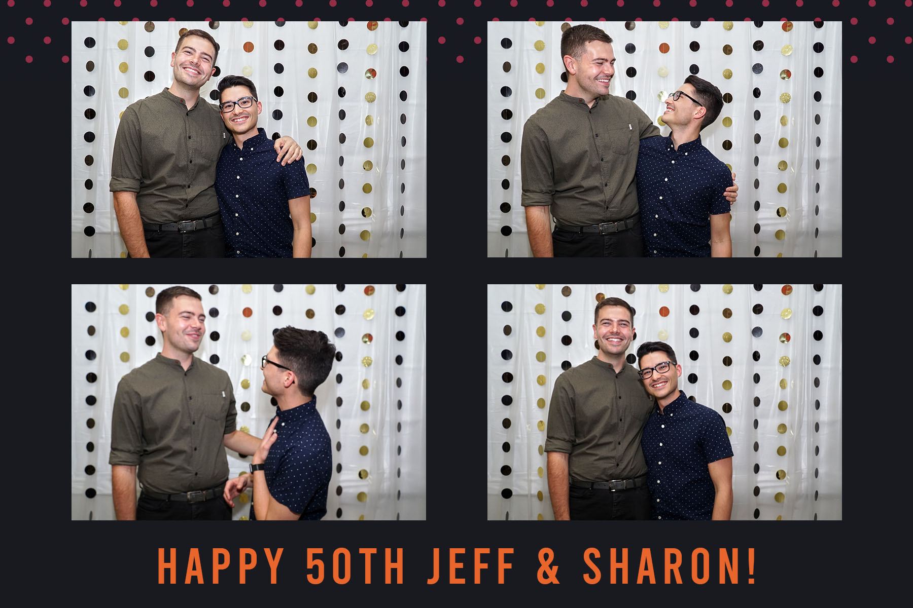
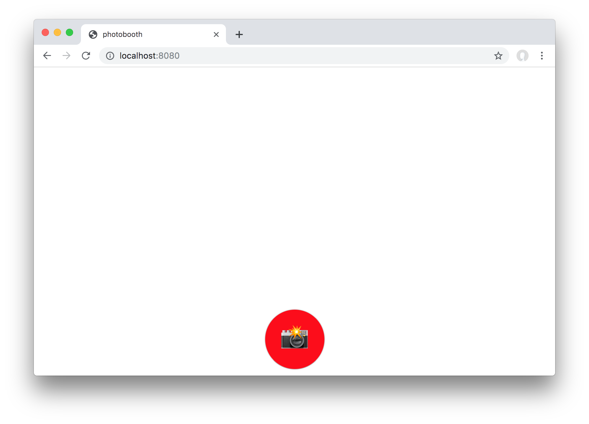

<sup>*The finished product*</sup>

I recently attended a 50th birthday party for my partners Aunt and Uncle. When planning, the idea of a photo booth came up. "I have a nice camera", I thought, deciding it shouldn't be too difficult to set up. I set out exploring different software options to help me with this. The criteria was as follows:

1. Tethers to cameras to allow an operator-free photo booth experience
1. Takes 3-4 pictures at a time
1. (optional) Accepts email addresses to send the pictures out
1. (optional) Creates photo strips or collages of each session
1. Is free or cheap
1. Works with Sony cameras
1. Runs on MacOS

Unfortunately, I couldn't find anything that met all my criteria. I did find some free or relatively cheap options, but they either didn't work with my Sony a6000 or required Windows to run. Most of them were just too expensive for my uses.

Through this research, I discovered that my camera actually has [an API](https://developer.sony.com/file/download/sony-camera-remote-api-beta-sdk-2/) you can interact with over the WiFi connection! So, with 3 days before the event, I put on my developer hat and set out to develop my own solution. Without further ado, let's dig into my solution.

#### The Requirements

When I first started this project, the plan was to create a simple UI that shows a live view of the camera, has a button that starts a 3-second countdown, then takes 4 pictures with a second or 2 in between.

After playing with the API and various libraries on different platforms, I realized it was too complex to support a live view of the camera. It is implemented as a streaming HTTP request that you need to parse in chunks to decode the image. While doable, it wasn't necessary so I decided to focus my efforts on taking and displaying the pictures.

#### The UI

To set this up quickly, I decided to make a quick Vue app. The app is dead simple, consisting of a single component that does everything.

The template just contains a grid of pictures and a button to start the countdown

```html
<div id="app">
  <div v-if="!cam.connected">
    Waiting for camera...
  </div>
  <div v-if="cam.connected">
    <div class="pics">
      
    </div>
    <div class="button-div" v-if="!active || countdown !== 0">
      <button class="button" @click="startPics" :disabled="active">
        <span v-if="countdown === 0">📸</span>
        <span v-if="countdown !== 0">{{ countdown }}</span>
      </button>
    </div>
  </div>
</div>
```



After the photos are taken...


About 10 seconds later, the app resets and allows another set of pictures to be taken.

The Javascript for this was pretty straightforward as well. Given more time, I could have improved the code quality, but this worked very well:

```javascript
import SonyCamera from 'sony-camera'

export default {
  name: 'App',
  components: {},
  data: function () {
    return {
      cam: new SonyCamera('localhost', 3000),
      liveViewFrame: '',
      pictures: [],
      countdown: 0,
      active: false
    }
  },
  methods: {
    startPics: function (event) {
      this.active = true
      this.countdown = 3
      var countID = setInterval(function () {
        this.countdown -= 1
        if (this.countdown !== 0) {
          return
        }
        clearInterval(countID)
        this.capture(4)
      }.bind(this), 1000)
    },
    capture: function (numToTake) {
      this.cam.capture(true, function (x, name, imageData) {
        if (name) {
          console.log(name)
          this.pictures.push(`http://localhost:3000/postview/${name}`)
          if (numToTake > 1) {
            setTimeout(function () { this.capture(numToTake - 1) }.bind(this), 2000)
          } else {
            setTimeout(function () {
              this.pictures = []
              this.active = false
            }.bind(this), 10000)
          }
        }
      }.bind(this))
    }
  },
  mounted: function () {
    this.cam.connect(console.log)
  }
}
```

I used the [`sony-camera`](https://www.npmjs.com/package/sony-camera) NPM package to interface with the camera. The only method I needed for this was `connect()` and `capture()`. When the button is clicked and the countdown has elapsed, I recursively call `capture()` using `setTimeout()` to space out the images. The callback to `capture()` gets the URL of the image to display and appends it to a list of URLs, which the template binds to the `src` attribute of `img` elements.

#### The Server

You may have noticed that I am initializing the `sony-camera` library with an address of `localhost:3000`. The reason for this is that my requests to the camera were being blocked by CORS, as the camera doesn't set any `Access-Control-Allow-Origin` header. So, I built a simple node.js proxy server to route my requests through.

```javascript
var http = require('http');

http.createServer(onRequest).listen(3000);

function onRequest(client_req, client_res) {
  console.log('serve: ' + client_req.url);

  var options = {
    hostname: '192.168.122.1',
    port: 8080,
    path: client_req.url,
    method: client_req.method,
    headers: client_req.headers
  };

  var proxy = http.request(options, function (res) {
    res.headers['access-control-allow-origin'] = '*'
    client_res.writeHead(res.statusCode, res.headers)
    res.pipe(client_res, {
      end: true
    }).on('error', console.log);
  });

  client_req.pipe(proxy, {
    end: true
  }).on('error', console.log);
}
```

All of the code is [here](https://gist.github.com/esalter-va/694487c86f6c6d79892e418840ad6c9a).

#### Putting it all Together

At the party, we set up a backdrop using table cloths and other decorations. We picked up some novelty glasses that people can wear for the pictures, and left a notepad for people to write down their email addresses on.

In front of the backdrop, I set up a small table with a tripod and my laptop. I set up my camera on the tripod with a speedlight attached, switched to manual mode and played with the settings until it looked right (I cheaped out on the speedlights, so they don't have TTL metering that works with my Sony camera. This requires some trial-and-error). I also brought my battery charger with 2 extra camera batteries, since the Sony a6000 doesn't allow you to charge via USB while using the camera.

Finally, I turned on the computer, enabled [Caffeine](http://lightheadsw.com/caffeine/) so the screensaver wouldn't start, and connected the camera:

1. Turn on the camera
1. Start the Smart Remote Control app on the camera
1. Connect the computer to the Camera's WiFi network
1. Start the proxy server
1. Start the app server
1. Open the browser to the app

And that's it! The program ran smoothly for the majority of the night. The camera battery died once, so I just swapped that out and re-connected. I also discovered the speedlight turns off automatically after not firing for some time, so I ended up with a couple batches of dark pictures.

#### Other Specs

**Camera**: Sony a6000  
**Lens**: Sony E 18-105 f/4 G  
**Focal Length**: 20mm  
**Aperature**: f/7.1  
**Shutter Speed**: 1/100 s  
**ISO** 640  

Ideally, I would have shot with my FE 50mm, but I just didn't have enough space for that. I chose a ~f/7 aperature to ensure I got everybody in focus, and I tried to keep the speedlight power low to avoid the photo booth being too distracting for the rest of the guests.

#### Summary

I was extremely happy with the result of this project. Being able to use what I already had to pull this off felt great. The photo booth got lots of use, with 232 photos being taken throughout the night. People had a lot of fun with it, and it gave the hosts some great mementos from the night. Had I given myself some more time, I probably could have made a more robust app, but it really wasn't necessary.

Check out Part 2, [Processing 232 Photo Booth Photos](/blog/processing-232-photo-booth-photos), to learn about how I processed the images.